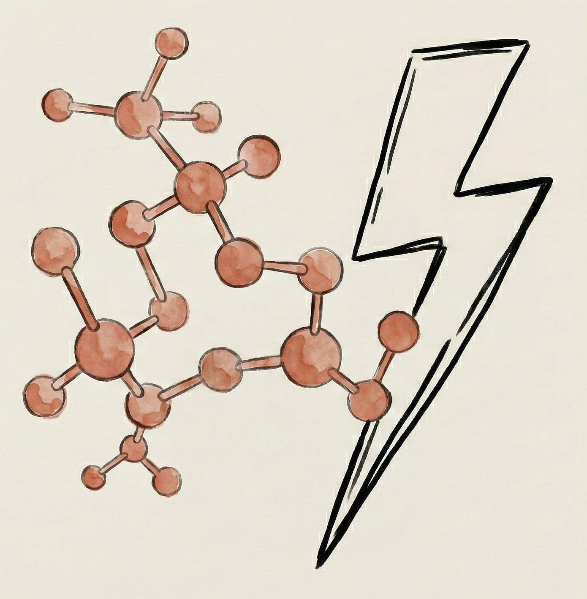

#  FlashMolecularDynamics

High-performance GPU kernels for neural network molecular dynamics simulation.

Preprint: "FlashSchNet: Fast and Accurate Coarse-Grained Neural Network Molecular Dynamics" [[arXiv]](https://arxiv.org/abs/2602.13140)

FlashMD provides Triton-optimized kernels that accelerate neural network force field evaluation during MD simulation. Currently supports **CGSchNet**; we are actively incorporating more architectures.

## Install

```bash
pip install flashmd
```

Or from source:

```bash
git clone https://github.com/unites-lab/flash-molecular-dynamics.git
cd flash-molecular-dynamics
pip install -e .
```

## Quick start

### Python API

```python
from flashmd.hub import from_pretrained, download_file

# Load pre-trained CGSchNet model from HuggingFace
model = from_pretrained("pingzhili/cg-schnet")

# Download initial configurations
configs_path = download_file("pingzhili/cg-schnet", "1enh_configurations.pt")
```

### Command-line simulation

```bash
# Langevin dynamics
flashmd-langevin --config examples/langevin.yaml \
  --model_file model_and_prior.pt \
  --structure_file 1enh_configurations.pt \
  --betas '[1.67]'

# Parallel tempering
flashmd-pt-langevin --config examples/parallel_tempering.yaml \
  --model_file model_and_prior.pt \
  --structure_file 1enh_configurations.pt \
  --betas '[1.67, 1.42, 1.16]'
```

### Optimizations

All Triton kernel optimizations, `torch.compile`, and W16A16 quantization are **enabled by default**. No environment variables or extra flags needed:

```bash
# All optimizations ON by default
flashmd-langevin --config config.yaml \
  --model_file model.pt --structure_file configs.pt --betas '[1.67]'

# Disable all optimizations (for baseline comparison)
flashmd-langevin --disable_optim --config config.yaml \
  --model_file model.pt --structure_file configs.pt --betas '[1.67]'
```

You can still fine-tune individual kernels via environment variables (`MLCG_USE_TRITON_MESSAGE_PASSING`, `MLCG_USE_FUSED_RBF`, `MLCG_USE_CSR`, `MLCG_USE_SRC_CSR_GRAD_X`, `MLCG_USE_FUSED_TANH_LINEAR`), setting any to `0` to disable.

## Performance

Benchmarked on 1ENH protein (batch size 128, A100 80GB GPU):

| Configuration | Throughput (timestep·mol/s) | GPU Memory (GB) | Speedup |
|---|---|---|---|
| CGSchNet | 438 | 94 | 1.0x |
| **FlashMD** | **2861** | **17** | **6.5x** |

Key optimizations under the hood:
- **Fused CFConv kernel**: Merges cutoff, gather, multiply, scatter into one Triton kernel
- **CSR segment reduce**: Replaces atomic scatter with deterministic CSR-based reduction
- **Fused distance+RBF+cutoff**: Single kernel for distance computation, Gaussian RBF expansion, and cosine cutoff
- **Fused tanh+linear**: Fuses activation and linear layer in interaction blocks
- **W16A16**: FP16 quantized filter/output networks using Tensor Cores
- **torch.compile**: Graph-level optimization of the simulation loop

## Pre-trained models

Available on HuggingFace: [`pingzhili/cg-schnet`](https://huggingface.co/pingzhili/cg-schnet)

- `model_and_prior.pt` -- Pre-trained CGSchNet with physical priors
- `1enh_configurations.pt` -- Initial configurations for 1ENH protein

## Citation

```bibtex
@article{li2025cgschnet,
  title={Transferable coarse-grained models of proteins by graph neural network and automatic differentiation},
  author={Li, Pingzhi and Chen, Yaoyi and Musil, F{\'e}lix and others},
  journal={Nature Chemistry},
  year={2025},
  doi={10.1038/s41557-025-01874-0}
}

@misc{li2026flashschnet,
  title={FlashSchNet: Fast and Accurate Coarse-Grained Neural Network Molecular Dynamics},
  author={Li, Pingzhi and Li, Hongxuan and Liu, Zirui and Lin, Xingcheng and Chen, Tianlong},
  year={2026},
  eprint={2602.13140},
  archivePrefix={arXiv},
  url={https://arxiv.org/abs/2602.13140},
}
```

## License

MIT
